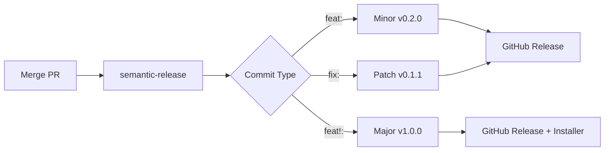

# Automated Release System - Setup Complete ✅

## 🎉 What Was Implemented

Your automated release system is now fully configured and ready to use!

### Components Added

1. **semantic-release** (v25.0.0) + plugins
   - Automatic version management
   - CHANGELOG generation
   - GitHub Release creation

2. **Workflows**
   - `.github/workflows/release.yml` - Automated releases on main
   - `.github/workflows/release-major.yml` - Manual major releases

3. **Configuration**
   - `.releaserc.json` - semantic-release config
   - `package.json` - Updated to v0.1.0, electron-builder config

4. **Documentation**
   - `docs/development/releases.md` - Complete release guide

## 🚀 How It Works

### Automatic Releases (Every Merge to Main)



### Release Matrix

| Commit Type | Version Change | Artifacts                          |
| ----------- | -------------- | ---------------------------------- |
| `feat:`     | 0.1.0 → 0.2.0  | GitHub Release only                |
| `fix:`      | 0.1.0 → 0.1.1  | GitHub Release only                |
| `feat!:`    | 0.1.0 → 1.0.0  | GitHub Release + Windows Installer |
| `chore:`    | No release     | Nothing                            |

## 🎯 Quick Start

### Create a Minor Release (Feature)

```bash
git checkout -b feat/new-feature
# Make changes
git commit -m "feat: add new feature"
git push origin feat/new-feature
# Create PR → Merge to main
# Result: v0.1.0 → v0.2.0 (no installer)
```

### Create a Patch Release (Bug Fix)

```bash
git checkout -b fix/bug
# Fix bug
git commit -m "fix: resolve issue"
git push origin fix/bug
# Create PR → Merge to main
# Result: v0.1.0 → v0.1.1 (no installer)
```

### Create a Major Release (Breaking Change)

**Option 1: Conventional Commit**

```bash
git checkout -b feat/breaking-change
# Make changes
git commit -m "feat!: breaking API change

BREAKING CHANGE: Redesigned API"
git push origin feat/breaking-change
# Create PR → Merge to main
# Result: v0.1.0 → v1.0.0 + Windows installer
```

**Option 2: PR Label**

```bash
# Create any PR with feat: or fix:
# Add label "semver-major"
# Merge to main
# Result: Major release + installer
```

**Option 3: Manual Workflow**

```
GitHub → Actions → "Create Major Release"
→ Run workflow → version=1.0.0
→ Result: v1.0.0 + installer
```

## 📦 Release Artifacts

### Minor/Patch Releases

- ✅ Git tag (v0.2.0)
- ✅ GitHub Release with notes
- ✅ CHANGELOG.md updated
- ❌ No installers

### Major Releases (v1.0.0+)

- ✅ Everything above, PLUS:
- ✅ Windows installer (.exe)
- ✅ Windows portable (.zip)
- ✅ Installation instructions
- ✅ System requirements

## 🔧 Configuration Details

### semantic-release Rules

```json
{
  "feat": "minor", // v0.1.0 → v0.2.0
  "fix": "patch", // v0.1.0 → v0.1.1
  "perf": "patch", // v0.1.0 → v0.1.1
  "feat!": "major", // v0.1.0 → v1.0.0
  "BREAKING CHANGE": "major",
  "chore": "no release",
  "docs": "no release",
  "style": "no release"
}
```

### Installer Build Condition

Installers are built ONLY when:

- Version is major (v1.0.0, v2.0.0, etc.)
- Major version > 0

This means:

- v0.1.0 → v0.2.0: No installer
- v0.2.0 → v0.3.0: No installer
- v0.9.0 → v1.0.0: **Installer built** ✅
- v1.0.0 → v2.0.0: **Installer built** ✅

### CHANGELOG Format

```markdown
## [1.0.0] - 2025-10-17

### 🎉 Features

- Add Monaco editor integration (#23)
- Add file tree with animations (#24)

### 🐛 Bug Fixes

- Fix sidebar rendering (#25)

### 💥 Breaking Changes

- Redesigned storage API

### Contributors

@rumankazi
```

## 🎨 PR Labels

Available labels for overriding:

| Label          | Effect                       |
| -------------- | ---------------------------- |
| `semver-major` | Force major release (v1.0.0) |
| `semver-minor` | Force minor release (v0.2.0) |
| `release-skip` | Skip release completely      |

## ✅ Verification Checklist

Before first release, ensure:

- [x] semantic-release installed
- [x] `.releaserc.json` configured
- [x] Workflows created (release.yml, release-major.yml)
- [x] package.json version set to 0.1.0
- [x] electron-builder configured
- [x] Documentation complete
- [ ] GITHUB_TOKEN has correct permissions (automatic)
- [ ] First commit to main follows convention
- [ ] Branch protection rules set (optional)

## 🐛 Troubleshooting

### Release not created?

- Check if commits are `feat:` or `fix:`
- View Actions tab for logs
- Verify commit message format

### Wrong version bump?

- Check commit type (feat vs fix)
- Look for `!` or `BREAKING CHANGE`
- PR labels override commits

### Installer not built?

- Only for major versions (v1.0.0+)
- Check build-installers job in Actions
- v0.x.y releases don't include installers by design

## 📚 Documentation

Full documentation: `docs/development/releases.md`

Topics covered:

- Detailed commit conventions
- All release workflows
- Troubleshooting guide
- Best practices
- Examples for every scenario

## 🚀 Next Steps

1. **Test the System**

   ```bash
   # Create a test branch
   git checkout -b feat/test-release

   # Make a trivial change
   echo "# Test" >> TEST.md

   # Commit with conventional format
   git add TEST.md
   git commit -m "feat: test automated release system"

   # Push and create PR
   git push origin feat/test-release

   # Merge to main
   # Watch Actions tab for release workflow
   # Check Releases page for v0.1.0
   ```

2. **Configure Branch Protection** (Optional)
   - Go to Settings → Branches
   - Add rule for `main`
   - Require PR before merging
   - Require status checks from PR qualification

3. **Create First Major Release** (When Ready)
   - Option A: Use manual workflow (Actions tab)
   - Option B: Merge PR with `feat!:` commit
   - Option C: Add `semver-major` label to PR

## 🎯 Summary

You now have:

- ✅ **Fully automated** release system
- ✅ **Zero manual** version bumping
- ✅ **Selective** installer builds (major only)
- ✅ **Auto-generated** CHANGELOG
- ✅ **Flexible** release triggers (commits, labels, manual)
- ✅ **Complete** documentation

**Current Version**: 0.1.0
**Next Minor**: 0.2.0 (on `feat:` merge)
**Next Patch**: 0.1.1 (on `fix:` merge)
**Next Major**: 1.0.0 (on `feat!:` merge + installer)

---

**Ready to release!** 🚀

Your first release will be created automatically when you merge a PR with `feat:` or `fix:` commits to main.
