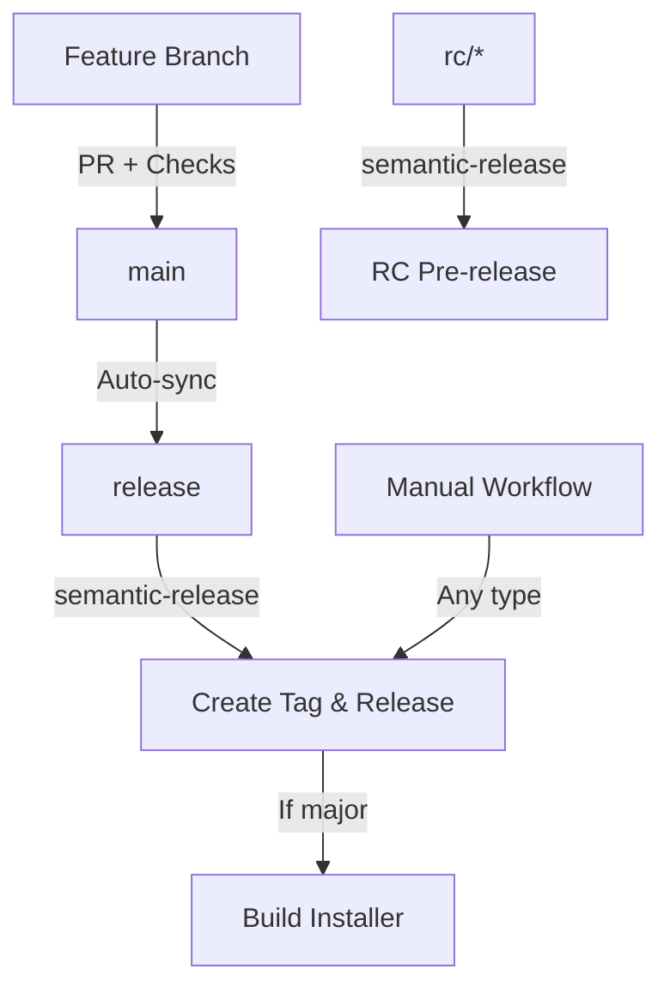

# Release Strategy - Zenoter

**Last Updated**: 2025-10-17  
**Status**: ✅ Production Ready

## 🎯 Overview

Zenoter uses **semantic-release** with a **dedicated release branch strategy** to automate versioning while maintaining branch protection on `main`.

### Key Features

- ✅ **No third-party actions** - Uses native GitHub CLI only
- ✅ **Protected main branch** - All merges require PR + checks
- ✅ **Automatic releases** - Triggered by conventional commits
- ✅ **Release candidates** - Full RC support with installers for testing
- ✅ **Flexible workflows** - Manual control when needed
- ✅ **Native tools only** - No external dependencies
- ✅ **PR release preview** - Shows what version will be released
- ✅ **Conflict detection** - Auto-resolves merge conflicts in release branch

## 🌿 Branch Strategy

### Structure

```
main (protected)
  ├── Requires PR + status checks
  ├── Auto-syncs to release branch
  └── Never receives direct version commits

release (semantic-release)
  ├── Receives auto-synced commits from main
  ├── semantic-release runs here
  ├── Version commits stay here
  └── Creates tags & GitHub Releases

rc/* or rc (optional)
  └── For release candidate testing
```

### Flow Diagram



### Why This Works

| Challenge                      | Solution                                          |
| ------------------------------ | ------------------------------------------------- |
| Can't push to protected `main` | semantic-release runs on `release` branch instead |
| Need PR reviews on main        | `main` stays fully protected, no exceptions       |
| Version commits bypass checks  | Version commits only go to `release`, not `main`  |
| Token permissions              | `GITHUB_TOKEN` can write to `release` branch      |
| No third-party actions         | Uses native `gh` CLI for all operations           |
| Merge conflicts                | Auto-detects and resolves by resetting to main    |
| Unknown release impact         | PR preview shows version and changes              |

### Conflict Resolution

**Scenario**: Version commits in `release` branch conflict with changes in `main`

**Strategy**:

1. Detect merge conflict during sync
2. Abort the merge
3. Force-reset `release` branch to match `main`
4. semantic-release recreates version commits on next release

**Why safe**:

- `main` is source of truth for code
- Version commits are auto-generated, can be recreated
- CHANGELOG in `release` is regenerated from git history
- No manual changes should exist in `release` branch

## 📊 PR Release Preview

Every PR to `main` automatically gets a **Release Preview** comment showing:

### What You'll See

**If Release Will Happen**:

```
🚀 Release Preview

✨ MINOR Release will be created ✅

Current: v0.1.0
Next:    v0.2.0

Artifacts: GitHub Release (no installer)

✨ Features
- abc1234 feat: add dark mode toggle
- def5678 feat: add search functionality

📋 Release Process
1. PR merged to main
2. Auto-sync workflow: main → release
3. semantic-release creates v0.2.0
4. GitHub Release created (no installer)
```

**If No Release**:

```
🚀 Release Preview

No release will be created ❌

This PR contains only non-release commits.

💡 To trigger a release, include commits with types:
- feat: for minor version bump
- fix: for patch version bump
- feat!: or BREAKING CHANGE: for major version bump
```

### Benefits

- ✅ Know before merging if a release will happen
- ✅ See exactly what version will be created
- ✅ Review all commits that will be in the release
- ✅ Verify breaking changes are properly marked
- ✅ Plan installer availability (major/RC only)

## 📦 Release Types

| Type       | Version Change     | Trigger                 | Artifacts              | Pre-release |
| ---------- | ------------------ | ----------------------- | ---------------------- | ----------- |
| **Major**  | 0.1.0 → 1.0.0      | `feat!:` or manual      | Release + Installer    | No          |
| **Minor**  | 0.1.0 → 0.2.0      | `feat:`                 | Release only           | No          |
| **Patch**  | 0.1.0 → 0.1.1      | `fix:`                  | Release only           | No          |
| **RC**     | 0.1.0 → 0.2.0-rc.1 | Manual or `rc/*` branch | Release + Installer ✨ | Yes         |
| **Custom** | Any                | Manual workflow         | Configurable           | Optional    |

**Note**: RC releases now include installers to enable proper testing before stable release.

## 🤖 Automatic Releases

### Trigger

Merging any PR with conventional commits to `main`

### Process

1. PR merged to `main` → triggers `sync-release-branch.yml`
2. Workflow syncs `main` → `release` branch
3. Push to `release` → triggers `release.yml`
4. semantic-release analyzes commits since last tag
5. Determines version bump from commit types
6. Creates git tag, GitHub Release, updates CHANGELOG
7. Pushes version commit to `release` branch
8. **If major release**: Builds Windows installer

### Conventional Commits

```bash
# Minor release (new feature)
git commit -m "feat: add dark mode toggle"
# → 0.1.0 → 0.2.0

# Patch release (bug fix)
git commit -m "fix: resolve sidebar rendering issue"
# → 0.1.0 → 0.1.1

# Major release (breaking change)
git commit -m "feat!: redesign API

BREAKING CHANGE: All API endpoints now require authentication"
# → 0.1.0 → 1.0.0 + Windows installer

# No release
git commit -m "docs: update README"
# → No release
```

## 🎛️ Manual Releases

### Workflow: Create Release

Go to **Actions** → **Create Release** → **Run workflow**

#### Options

**1. Release Type** (dropdown)

- `major` - Breaking changes (v1.0.0, v2.0.0)
- `minor` - New features (v0.2.0, v0.3.0)
- `patch` - Bug fixes (v0.1.1, v0.1.2)
- `release-candidate` - Pre-release testing (v0.2.0-rc.1)
- `custom` - Custom version string

**2. Custom Version** (text)

- Only required if type = `custom`
- Format: `X.Y.Z` or `X.Y.Z-rc.N` or `X.Y.Z-beta.N`
- Example: `2.0.0-beta.1`

**3. Source Branch** (text)

- Branch to create release from
- Default: `main`
- Can use feature branches for testing

**4. Pre-release** (checkbox)

- Mark as pre-release on GitHub
- Auto-checked for RC type
- Prevents marking as "latest"

**5. Release Notes** (textarea)

- Optional additional notes
- Appended to auto-generated changelog

### Examples

#### Example 1: Create Major Release

```yaml
Release type: major
Custom version: (leave empty)
Source branch: main
Pre-release: false
Release notes: |
  Complete rewrite of the editor component

  BREAKING CHANGE: New API for editor initialization
```

**Result**: v1.0.0 + Windows installer

#### Example 2: Release Candidate

```yaml
Release type: release-candidate
Custom version: (leave empty)
Source branch: main
Pre-release: true (auto-checked)
Release notes: 'Please test the new search feature'
```

**Result**: v0.2.0-rc.1 (pre-release) with installer for testing ✨

#### Example 3: Beta from Feature Branch

```yaml
Release type: custom
Custom version: 2.0.0-beta.1
Source branch: feat/new-architecture
Pre-release: true
Release notes: 'Early preview of v2.0 architecture'
```

**Result**: v2.0.0-beta.1 (pre-release, no installer)

**Note**: Custom releases don't auto-build installers. For custom releases with installers, manually run the build after workflow completes.

## 🧪 Release Candidates

### Method 1: Manual Workflow

```
Actions → Create Release
Release type: release-candidate
Source branch: main
→ Creates v0.2.0-rc.1
```

### Method 2: RC Branch

```bash
# Create RC branch
git checkout -b rc/v1.0.0
# or
git checkout -b rc

# Push to GitHub
git push origin rc/v1.0.0

# semantic-release auto-detects RC branch
# Creates: v1.0.0-rc.1 (pre-release)
```

### RC Auto-Increment

```bash
# First RC
rc/v1.0.0 → v1.0.0-rc.1

# Push more commits
rc/v1.0.0 → v1.0.0-rc.2

# Each push increments RC number
```

### Promoting RC to Stable

#### Option A: Merge to Main (Recommended)

```bash
git checkout main
git merge rc/v1.0.0
git push origin main

# Auto-sync → release → semantic-release
# → Creates v1.0.0 (stable) + installer
```

#### Option B: Manual Workflow

```
Actions → Create Release
Release type: major
Source branch: rc/v1.0.0
Pre-release: false
→ Creates v1.0.0 + installer
```

## 📋 Release Artifacts

### All Releases

- Git tag (e.g., `v1.0.0`)
- GitHub Release page
- Auto-generated changelog
- Release notes

### Major Releases (v1.0.0+)

- Windows installer (.exe) ~80MB
- Windows portable (.zip) ~100MB
- Installation instructions
- System requirements

### Release Candidates

- Marked as "pre-release" on GitHub
- Windows installer (.exe) - **for testing** ✨
- Windows portable (.zip) - **for testing** ✨
- Not shown as "latest" release

### Minor/Patch Releases

- GitHub Release only
- No installers (not needed for minor updates)

## 🔧 Setup & Configuration

### Required Workflows

1. **`.github/workflows/sync-release-branch.yml`**
   - Syncs `main` → `release` on every push
   - Creates `release` branch if missing
   - **Detects and resolves merge conflicts automatically**

2. **`.github/workflows/release.yml`**
   - Runs semantic-release on `release` branch
   - Builds installers for major releases (including RC)

3. **`.github/workflows/release-major.yml`**
   - Manual workflow for all release types
   - Supports RC, beta, custom versions
   - Builds installers for major and RC releases

4. **`.github/workflows/pr-release-preview.yml`**
   - **Automatic preview of release impact on PRs**
   - Shows version that will be created
   - Lists all commits included in release
   - Updates on every PR change

### semantic-release Config

**`.releaserc.json`**:

```json
{
  "branches": [
    "release",
    {
      "name": "rc",
      "channel": "rc",
      "prerelease": "rc"
    },
    {
      "name": "rc/*",
      "channel": "rc",
      "prerelease": "rc"
    }
  ]
}
```

### Branch Protection (Recommended)

**For `main` branch:**

- ✅ Require pull request before merging
- ✅ Require status checks to pass (all 7 from PR qualification)
- ✅ Require approvals (1 minimum)
- ✅ Restrict pushes to admins only

**For `release` branch:**

- ✅ Allow GitHub Actions to push (for version commits)
- ⚠️ Do NOT require PR or checks (semantic-release needs to push)

## 🚀 Quick Reference

### Automatic Release

```bash
# Create feature
git checkout -b feat/new-feature

# Make changes
git commit -m "feat: add new feature"

# Push and create PR
git push origin feat/new-feature

# Merge PR to main → auto-releases as v0.2.0
```

### Release Candidate

```bash
# Method 1: Manual workflow
Actions → Create Release → release-candidate

# Method 2: RC branch
git checkout -b rc/v1.0.0
git push origin rc/v1.0.0
```

### Major Release

```bash
# Method 1: Breaking change commit
git commit -m "feat!: breaking API change

BREAKING CHANGE: Redesigned API"
# Merge to main → auto-releases as v1.0.0 + installer

# Method 2: Manual workflow
Actions → Create Release → major
```

## 🐛 Troubleshooting

### Sync Workflow Failed

**Symptom**: `sync-release-branch.yml` fails with permission error

**Solution**:

```bash
# Check if release branch exists
git fetch origin
git branch -r | grep release

# If missing, create manually
git checkout -b release
git push origin release
```

### semantic-release Skipped Release

**Symptom**: No release created despite merging feat/fix

**Causes**:

1. No `feat:` or `fix:` commits since last release
2. Only `chore:`, `docs:`, `style:` commits (no release)
3. All commits have `[skip ci]` or `[skip release]`

**Check**:

```bash
# View commits since last tag
git log $(git describe --tags --abbrev=0)..HEAD --oneline
```

### Installer Not Built

**Symptom**: Release created but no installer attached

**Expected**: Installers are built for:

- Major releases (v1.0.0, v2.0.0, etc.)
- Release candidates (RC) for testing
- NOT v0.x.x releases (minor/patch)
- NOT beta/pre-releases (unless RC)

**Force installer build**:

```
Actions → Create Release
Release type: major
→ Always builds installer
```

### Wrong Version Bump

**Symptom**: Expected minor, got patch (or vice versa)

**Cause**: Commit message format

**Check**:

```bash
# Correct formats
feat: new feature      → minor (0.1.0 → 0.2.0)
fix: bug fix          → patch (0.1.0 → 0.1.1)
feat!: breaking       → major (0.1.0 → 1.0.0)
```

## 📚 Resources

- [Conventional Commits](https://www.conventionalcommits.org/)
- [Semantic Versioning](https://semver.org/)
- [semantic-release Docs](https://semantic-release.gitbook.io/)
- [GitHub CLI Reference](https://cli.github.com/manual/)

## 📞 Support

For release issues:

1. Check workflow logs in Actions tab
2. Review this documentation
3. Check `CHANGELOG.md` in `release` branch
4. Open issue with `ci/cd` label

---

**Next Steps**:

1. ✅ Workflows configured
2. ✅ semantic-release installed
3. ⏳ Create `release` branch (auto-created on first sync)
4. ⏳ Test with a feature PR to main
5. ⏳ Configure branch protection rules
