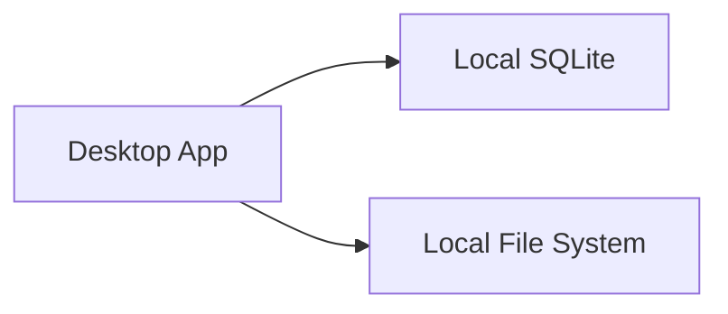
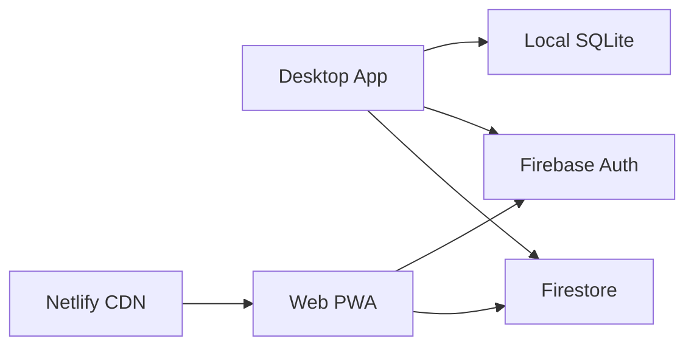

# Zenoter Architecture

## Overview

Zenoter is a modern, developer-focused note-taking application that prioritizes beautiful animations and smooth user experience. Built with Electron and React, it offers a VS Code-like interface with powerful markdown editing capabilities, version control, and cross-platform synchronization.

## Deployment Strategy

### Incremental Release Approach

We use feature flags and gradual rollouts to minimize infrastructure costs while maintaining flexibility. Our deployment strategy scales with user growth:

1. **Phase 1 (0-100 users)**: Local-only, zero infrastructure
2. **Phase 2 (100-1K users)**: Firebase free tier
3. **Phase 3 (1K-10K users)**: Minimal GCP setup
4. **Phase 4 (10K+ users)**: Full GCP with auto-scaling

### Feature Flags System

```typescript
// Central feature flag configuration
interface FeatureFlag {
  enabled: boolean;
  rolloutPercentage?: number;
  userGroups?: ('beta' | 'premium' | 'all')[];
  remoteConfigKey?: string;
}

// Feature flags are checked at runtime
if (getFeatureFlag('CLOUD_SYNC')) {
  // Enable cloud sync features
}
```

### Infrastructure Architecture

#### Current (Phase 1) - Zero Cost



#### Phase 2 - Free Tier Services



#### Phase 3 - Minimal GCP


## Tech Stack Decisions

### Core Framework: Electron + React 18+

**Why we chose this:**

- **Electron**: Despite being heavier than Tauri (~150MB vs ~10MB), Electron provides mature ecosystem support for rich animations and complex UI interactions. Since we prioritized slick, modern animations over lightweight footprint, Electron's maturity and extensive library support made it the ideal choice.
- **React 18+**: Offers concurrent features, extensive animation library ecosystem (Framer Motion), and large community support for complex UI patterns.

**Alternatives considered:**

- Tauri: Lighter but less mature animation ecosystem
- SolidJS/Svelte: Smaller bundle but fewer animation libraries

### Editor: Monaco Editor

**Why we chose this:**

- Exact VS Code editing experience that developers expect
- Built-in syntax highlighting for multiple languages
- Smooth scrolling and cursor animations
- IntelliSense and advanced editing features
- Worth the additional weight for superior UX

**Alternatives considered:**

- CodeMirror 6: Lighter but less feature-rich
- Custom textarea: Too much development overhead

### Animation Stack: Framer Motion + Lottie

**Why we chose this:**

- **Framer Motion**: Industry-leading React animation library with spring physics, gesture support, and declarative API
- **Lottie**: Perfect for micro-interactions and complex icon animations
- Provides the "slick, modern, smooth animations" that are core to Zenoter's identity

**Alternatives considered:**

- React Spring: Good but less comprehensive than Framer Motion
- CSS animations only: Limited for complex interactions
- GSAP: Overkill for our needs, less React-friendly

### State Management: Zustand

**Why we chose this:**

- Lightweight (8kb) yet powerful
- Simple API without boilerplate
- Built-in TypeScript support
- DevTools support
- Perfect for medium-complexity apps

**Alternatives considered:**

- Redux Toolkit: Too much boilerplate for our needs
- MobX: More complex than necessary
- Context API: Insufficient for complex state

### Styling: CSS Modules

**Why we chose this:**

- **CSP Compliant**: No inline styles or runtime injection (unlike Emotion/styled-components)
- Scoped styles prevent naming conflicts
- TypeScript support via module declarations
- Vite has built-in support (zero config)
- Works seamlessly with CSS variables for theming
- No runtime overhead or JavaScript bundle inflation
- Compatible with strict Content Security Policy (`style-src 'self'`)

**Why NOT CSS-in-JS (Emotion/styled-components):**

- Violates CSP without `'unsafe-inline'` (security risk)
- Runtime style injection causes performance overhead
- Increases JavaScript bundle size
- Conflicts with our strict security requirements

**Alternatives considered:**

- Emotion CSS-in-JS: CSP violations, runtime overhead
- Styled Components: Same CSP issues as Emotion
- Tailwind CSS: Less suitable for complex animations, harder to theme dynamically
- Plain CSS: No scoping, naming conflicts

### Database

**Local: SQLite**

- Single file database perfect for desktop apps
- No setup required
- Excellent performance for local queries
- Easy backup/restore

**Cloud: PostgreSQL (Phase 3+)**

- Robust, scalable for multi-user sync
- JSON support for flexible note metadata
- Strong consistency for version control

**Interim Cloud: Firestore (Phase 2)**

- Free tier (1GB storage, 50K reads/day)
- Real-time sync capabilities
- No infrastructure management

### Testing: Vitest + Playwright

**Why we chose this:**

- **Vitest**: Faster than Jest, native ESM support, compatible with Jest API
- **Playwright**: Cross-platform E2E testing, better than Cypress for Electron apps

### Cloud Platform: GCP (Gradual Adoption)

**Why GCP:**

- Generous free tier ($300 credit)
- Cloud Run for serverless scaling
- Integrated with Firebase
- Pay-per-use model ideal for gradual scaling

## Folder Structure

```
zenoter/
├── .github/
│   └── copilot-instructions.md    # AI context
├── .vscode/
│   └── settings.json               # VSCode config
├── electron/
│   ├── main.ts                     # Main process
│   ├── preload.ts                  # Preload scripts
│   └── ipc/                        # IPC handlers
├── src/
│   ├── components/
│   │   ├── Editor/
│   │   │   ├── MonacoEditor.tsx
│   │   │   ├── EditorToolbar.tsx
│   │   │   └── Editor.test.tsx
│   │   ├── FileTree/
│   │   │   ├── FileTree.tsx
│   │   │   ├── TreeNode.tsx
│   │   │   ├── DragDropContext.tsx
│   │   │   └── FileTree.test.tsx
│   │   ├── Preview/
│   │   │   ├── MarkdownPreview.tsx
│   │   │   ├── PreviewPane.tsx
│   │   │   └── Preview.test.tsx
│   │   ├── Search/
│   │   │   ├── SearchBar.tsx
│   │   │   ├── SearchResults.tsx
│   │   │   └── Search.test.tsx
│   │   └── common/
│   │       ├── Button.tsx
│   │       ├── Modal.tsx
│   │       └── Toast.tsx
│   ├── animations/
│   │   ├── presets.ts              # Reusable animations
│   │   ├── transitions.ts          # Page transitions
│   │   └── spring-configs.ts       # Spring physics
│   ├── config/
│   │   ├── featureFlags.ts         # Feature flag configuration
│   │   ├── environment.ts          # Environment config
│   │   └── constants.ts            # App constants
│   ├── stores/
│   │   ├── noteStore.ts            # Note management
│   │   ├── uiStore.ts              # UI state
│   │   ├── syncStore.ts            # Sync state
│   │   └── settingsStore.ts        # User preferences
│   ├── services/
│   │   ├── database.service.ts     # SQLite operations
│   │   ├── sync.service.ts         # Cloud sync
│   │   ├── search.service.ts       # Full-text search
│   │   ├── featureFlag.service.ts  # Feature flag management
│   │   └── export.service.ts       # Import/Export
│   ├── database/
│   │   ├── schema.ts               # DB schema
│   │   ├── migrations/             # DB migrations
│   │   └── queries.ts              # SQL queries
│   ├── hooks/
│   │   ├── useAnimation.ts         # Animation helpers
│   │   ├── useKeyboard.ts          # Keyboard shortcuts
│   │   ├── useAutoSave.ts          # Auto-save logic
│   │   ├── useFeatureFlag.ts       # Feature flag hook
│   │   └── useTheme.ts             # Theme management
│   ├── styles/
│   │   ├── theme.ts                # Theme definitions
│   │   ├── global.ts               # Global styles
│   │   └── animations.css          # CSS animations
│   ├── types/
│   │   ├── note.types.ts           # Type definitions
│   │   └── index.ts                # Type exports
│   └── utils/
│       ├── markdown.ts             # Markdown utilities
│       └── debounce.ts             # Helper functions
├── tests/
│   ├── unit/                       # Unit tests
│   ├── integration/                # Integration tests
│   ├── e2e/                        # End-to-end tests
│   └── fixtures/                   # Test data
├── package.json
├── tsconfig.json
├── vite.config.ts
├── electron-builder.yml           # Build configuration
├── ARCHITECTURE.md                 # This file
├── plan.md                         # Development plan
└── README.md
```

## Key Design Patterns

### 1. Container/Presenter Pattern

```typescript
// Container: Logic and state
const NoteEditorContainer = () => {
  const { notes, updateNote } = useNoteStore();
  const { autoSave } = useAutoSave();

  return <NoteEditor notes={notes} onUpdate={updateNote} />;
};

// Presenter: Pure UI component
const NoteEditor = ({ notes, onUpdate }) => {
  // Pure rendering logic
};
```

### 2. Animation HOCs

```typescript
// Consistent animation wrapper
const withFadeIn = (Component) => {
  return motion(Component).attrs({
    initial: { opacity: 0 },
    animate: { opacity: 1 },
    exit: { opacity: 0 },
  });
};
```

### 3. Service Layer Pattern

```typescript
// Separate business logic from UI
class NoteService {
  async createNote(data: NoteData): Promise<Note> {
    // Business logic
    // Database operations
    // Validation
  }
}
```

### 4. Custom Hooks for Reusability

```typescript
// Encapsulate complex logic
const useSearch = (query: string) => {
  const [results, setResults] = useState([]);
  const [loading, setLoading] = useState(false);
  // Search implementation
  return { results, loading };
};
```

### 5. Feature Flag Pattern

```typescript
// Conditional feature rendering
const CloudSyncButton = () => {
  const isEnabled = useFeatureFlag('CLOUD_SYNC');

  if (!isEnabled) return null;

  return <Button onClick={syncToCloud}>Sync</Button>;
};
```

## Development Principles

1. **Test-Driven Development (TDD)**
   - Write tests first, then implement
   - Minimum 80% code coverage
   - E2E tests for critical user flows

2. **Animation-First Design**
   - Every interaction should be animated
   - Use spring physics for natural movement
   - Performance budget: 60fps minimum

3. **Type Safety**
   - Strict TypeScript configuration
   - No `any` types allowed
   - Interfaces for all component props

4. **Accessibility**
   - WCAG 2.1 AA compliance
   - Keyboard navigation for all features
   - Screen reader support
   - Respect prefers-reduced-motion

5. **Performance Optimization**
   - Lazy loading for heavy components
   - Virtual scrolling for long lists
   - Debounced inputs
   - Memoization where appropriate

6. **Cost-Conscious Infrastructure**
   - Start with free tiers
   - Scale only when necessary
   - Monitor usage closely
   - Optimize for efficiency

## Security Considerations

- **Local Storage**: SQLite database encrypted with user-provided key
- **Cloud Sync**: End-to-end encryption for sensitive notes
- **Authentication**: OAuth 2.0 with providers (GitHub, Google, Microsoft)
- **Data Sanitization**: All markdown rendered with DOMPurify
- **Electron Security**: Context isolation, disabled node integration in renderers
- **API Security**: Rate limiting, JWT tokens, CORS properly configured
- **Content Security Policy (CSP)**: Strict policy without `'unsafe-inline'`
  - All styles in external CSS files (CSS Modules)
  - No inline event handlers
  - Scripts only from same origin
  - CSP header: `default-src 'self'; script-src 'self'; style-src 'self'; img-src 'self' data: https:;`

## Build and Deployment

### Development

```bash
npm run dev              # Start Electron in development
npm run test:watch       # Run tests in watch mode
npm run test:e2e         # Run Playwright tests
npm run feature:toggle   # Toggle feature flags locally
```

### Production Build

```bash
npm run build            # Build React app
npm run electron:build   # Build Electron app
npm run dist            # Create installers
```

### Deployment Pipeline

```yaml
Phase 1: GitHub Releases
  - Manual upload of installers
  - Automatic update checks

Phase 2: CI/CD with GitHub Actions
  - Automated builds on tag
  - Deploy web to Netlify
  - Upload to GitHub Releases

Phase 3: Full Pipeline
  - Deploy API to Cloud Run
  - Database migrations
  - Feature flag updates
  - A/B test configuration
```

### Platform Targets

- **Phase 1**: Windows (NSIS installer), Web (PWA)
- **Phase 2**: macOS (DMG), Linux (AppImage, Snap)
- **Phase 3**: iOS, Android (React Native ports)

## Performance Targets

- **Startup Time**: < 3 seconds
- **Search Response**: < 100ms for 10,000 notes
- **Animation FPS**: Consistent 60fps
- **Memory Usage**: < 300MB idle, < 500MB active
- **Note Loading**: < 50ms for average note
- **Auto-save Delay**: 500ms after last keystroke
- **Sync Time**: < 5 seconds for 100 notes

## Cost Management

### Monthly Cost Projections

- **Phase 1**: $0 (local only)
- **Phase 2**: $0-10 (free tiers)
- **Phase 3**: $30-50 (minimal GCP)
- **Phase 4**: $200+ (scale with usage)

### Cost Optimization Strategies

1. Use Firebase free tier initially
2. Implement efficient caching
3. Compress data before storage
4. Use CDN for static assets
5. Implement request batching
6. Monitor and optimize queries

## Future Extensibility

### Plugin System (v2.0)

- Monaco editor extensions
- Custom markdown renderers
- Theme marketplace
- Export format plugins

### Collaboration Features (v3.0)

- Real-time collaborative editing
- Shared workspaces
- Comments and mentions
- Activity feeds

## Created By

- **Developer**: @rumankazi
- **Project Start**: 2025-10-17
- **Version**: 1.0.0-alpha
- **Current Phase**: Phase 1 - MVP Development
