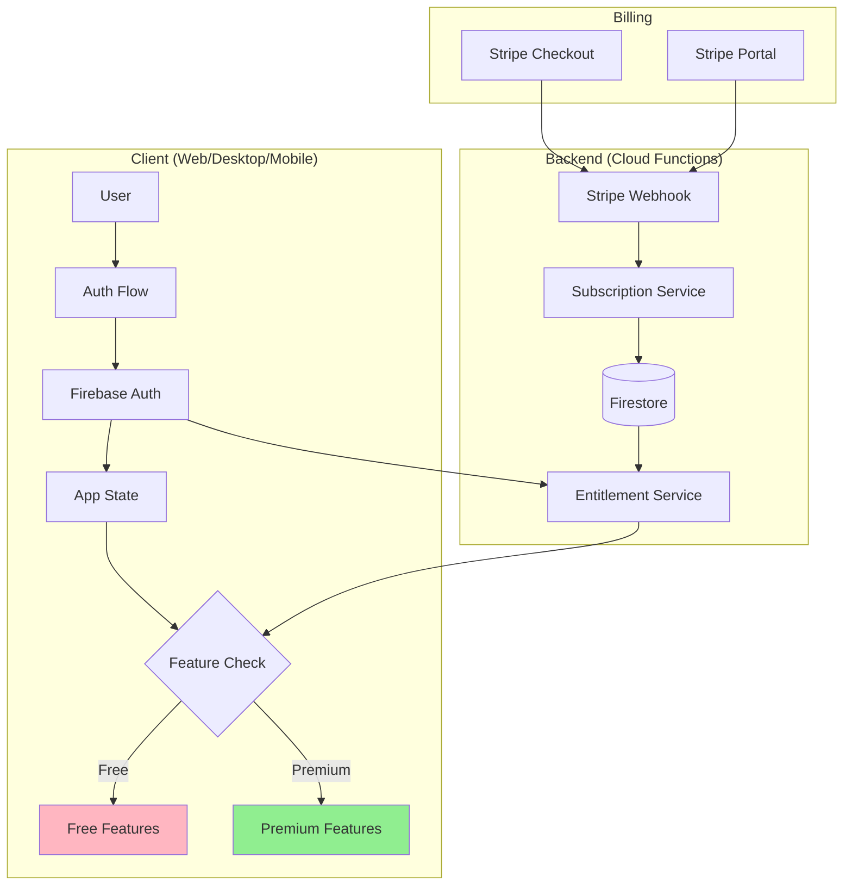

# Premium User Infrastructure

**Last Updated**: 2025-10-19  
**Purpose**: Complete architecture for premium/privileged user management, billing, and entitlement enforcement  
**Target Audience**: Engineering, Product, DevOps teams

---

## Overview

This document defines the **complete infrastructure** for managing premium users in Zenoter, from subscription purchase to feature access enforcement. It covers:

1. **User Authentication** - How users sign up and log in
2. **Subscription Management** - How users become premium
3. **Entitlement System** - How we verify premium status
4. **Feature Gating** - How we enforce premium-only features
5. **Billing Integration** - How we handle payments
6. **Data Model** - Database schemas for users, subscriptions, usage
7. **Security** - Preventing abuse and unauthorized access

---

## Architecture Overview



---

## 1. User Authentication System

### Tech Stack

- **Provider**: Firebase Authentication
- **Methods**:
  - Email/Password (primary)
  - Google OAuth
  - GitHub OAuth
  - Microsoft OAuth (Enterprise)
- **Session Management**: Firebase ID Tokens (1 hour TTL, auto-refresh)

### User Schema (Firebase Auth)

```typescript
interface FirebaseUser {
  uid: string; // Unique user ID
  email: string;
  emailVerified: boolean;
  displayName: string | null;
  photoURL: string | null;
  createdAt: string;
  lastLoginAt: string;

  // Custom claims (set via Admin SDK)
  customClaims: {
    tier?: 'free' | 'pro' | 'team' | 'enterprise';
    premium?: boolean; // Quick boolean check
    teamId?: string; // For team workspaces
    stripeCustomerId?: string; // Link to Stripe
  };
}
```

### Authentication Flow

```typescript
// 1. User signs up/logs in
const user = await signInWithEmailAndPassword(auth, email, password);

// 2. Get ID token with custom claims
const idToken = await user.getIdToken(true); // Force refresh to get claims

// 3. Decode token to get tier
const decodedToken = await admin.auth().verifyIdToken(idToken);
const userTier = decodedToken.tier || 'free';

// 4. Client stores tier in app state
setUserTier(userTier);
```

---

## 2. Subscription Management

### Tiers & Pricing

| Tier           | Price                | Billing        | Features                                                 |
| -------------- | -------------------- | -------------- | -------------------------------------------------------- |
| **Free**       | $0                   | N/A            | Basic editor, local storage, daily auto-commits          |
| **Pro**        | $9/month or $90/year | Monthly/Annual | + On-demand commits, advanced search, snippets, diagrams |
| **Team**       | $15/user/month       | Monthly        | + Workspaces, RBAC, DB runner, Git integration           |
| **Enterprise** | Custom               | Annual         | + AI assistant, terminal, SSO, on-premise                |

### Subscription States

```typescript
type SubscriptionStatus =
  | 'active' // Paid and current
  | 'trialing' // Free trial period
  | 'past_due' // Payment failed, grace period
  | 'canceled' // User canceled, access until period end
  | 'incomplete' // Payment pending
  | 'expired'; // No longer active

interface Subscription {
  id: string; // Firestore doc ID
  userId: string; // Firebase Auth UID
  tier: 'pro' | 'team' | 'enterprise';
  status: SubscriptionStatus;

  // Stripe details
  stripeCustomerId: string;
  stripeSubscriptionId: string;
  stripePriceId: string;

  // Dates
  createdAt: Timestamp;
  currentPeriodStart: Timestamp;
  currentPeriodEnd: Timestamp;
  cancelAt: Timestamp | null; // Scheduled cancellation
  canceledAt: Timestamp | null; // When user canceled
  trialEnd: Timestamp | null;

  // Team-specific
  teamId?: string; // For team subscriptions
  seats?: number; // Number of team members

  // Metadata
  billingCycle: 'monthly' | 'annual';
  amount: number; // In cents
  currency: string;
}
```

### Firestore Data Model

```
firestore/
├── users/{uid}/                      # User profile data
│   ├── email: string
│   ├── displayName: string
│   ├── tier: 'free' | 'pro' | 'team' | 'enterprise'
│   ├── stripeCustomerId: string
│   ├── createdAt: Timestamp
│   └── metadata: object
│
├── subscriptions/{subscriptionId}/   # Subscription records
│   └── (Subscription interface above)
│
├── teams/{teamId}/                   # Team workspaces
│   ├── name: string
│   ├── ownerId: string               # User who created team
│   ├── subscriptionId: string
│   ├── seats: number
│   └── members/{userId}              # Subcollection
│       ├── role: 'owner' | 'admin' | 'editor' | 'viewer'
│       ├── joinedAt: Timestamp
│       └── invitedBy: string
│
└── usage/{userId}/                   # Usage tracking (for limits)
    ├── commits/
    │   ├── onDemandCount: number     # Free: 1/month, Pro: unlimited
    │   ├── lastResetAt: Timestamp
    │   └── history: array
    ├── aiRequests/
    │   ├── count: number             # Pro: 100/day, Enterprise: unlimited
    │   └── lastResetAt: Timestamp
    └── storage/
        ├── bytesUsed: number
        └── quota: number
```

---

## 3. Entitlement System

### Server-Side Verification (Cloud Functions)

**CRITICAL**: Never trust the client. Always verify entitlement on the backend.

```typescript
// Cloud Function: Check entitlement before premium action
export const createOnDemandCommit = functions.https.onCall(async (data, context) => {
  // 1. Verify authentication
  if (!context.auth) {
    throw new functions.https.HttpsError('unauthenticated', 'User not authenticated');
  }

  const userId = context.auth.uid;

  // 2. Get subscription from Firestore
  const subscriptions = await db
    .collection('subscriptions')
    .where('userId', '==', userId)
    .where('status', 'in', ['active', 'trialing'])
    .get();

  if (subscriptions.empty) {
    // 3. Check free tier usage limits
    const usage = await db.collection('usage').doc(userId).get();
    const onDemandCount = usage.data()?.commits?.onDemandCount || 0;
    const lastReset = usage.data()?.commits?.lastResetAt?.toDate();

    // Reset monthly counter
    const now = new Date();
    if (!lastReset || now.getMonth() !== lastReset.getMonth()) {
      await db
        .collection('usage')
        .doc(userId)
        .set(
          {
            commits: { onDemandCount: 0, lastResetAt: admin.firestore.Timestamp.now() },
          },
          { merge: true }
        );
    }

    if (onDemandCount >= 1) {
      throw new functions.https.HttpsError(
        'permission-denied',
        'Free tier: 1 on-demand commit per month. Upgrade to Pro for unlimited.',
        { upgradeUrl: 'https://zenoter.app/pricing' }
      );
    }

    // Increment counter
    await db
      .collection('usage')
      .doc(userId)
      .update({
        'commits.onDemandCount': admin.firestore.FieldValue.increment(1),
      });
  }

  // 4. Create commit (premium or within free limit)
  const commitId = await createCommitBlob(userId, data.message, data.notes);

  return { commitId, success: true };
});
```

### Client-Side Feature Gating

```typescript
// Hook: useEntitlement.ts
import { useAuth } from './useAuth';
import { useEffect, useState } from 'react';
import { db } from '../services/firebase';

export type UserTier = 'free' | 'pro' | 'team' | 'enterprise';

interface Entitlement {
  tier: UserTier;
  features: {
    onDemandCommits: boolean;
    advancedSearch: boolean;
    snippetLibrary: boolean;
    browserExtension: boolean;
    diagrams: boolean;
    teamWorkspaces: boolean;
    databaseRunner: boolean;
    gitIntegration: boolean;
    aiAssistant: boolean;
    terminalIntegration: boolean;
    sso: boolean;
  };
  limits: {
    snippets: number; // Free: 10, Pro+: unlimited
    commits: number; // Free: 1/month, Pro+: unlimited
    aiRequests: number; // Pro: 100/day, Enterprise: unlimited
    storage: number; // In bytes
  };
  subscription?: {
    status: string;
    currentPeriodEnd: Date;
    cancelAtPeriodEnd: boolean;
  };
}

export const useEntitlement = (): Entitlement | null => {
  const { user } = useAuth();
  const [entitlement, setEntitlement] = useState<Entitlement | null>(null);

  useEffect(() => {
    if (!user) {
      setEntitlement(null);
      return;
    }

    // Listen to subscription changes
    const unsubscribe = db
      .collection('subscriptions')
      .where('userId', '==', user.uid)
      .where('status', 'in', ['active', 'trialing'])
      .onSnapshot((snapshot) => {
        if (snapshot.empty) {
          // Free tier
          setEntitlement(getFreeTierEntitlement());
        } else {
          const sub = snapshot.docs[0].data();
          setEntitlement(getPremiumEntitlement(sub.tier, sub));
        }
      });

    return () => unsubscribe();
  }, [user]);

  return entitlement;
};

// Feature matrix
const getFreeTierEntitlement = (): Entitlement => ({
  tier: 'free',
  features: {
    onDemandCommits: false,
    advancedSearch: false,
    snippetLibrary: false,
    browserExtension: false,
    diagrams: false,
    teamWorkspaces: false,
    databaseRunner: false,
    gitIntegration: false,
    aiAssistant: false,
    terminalIntegration: false,
    sso: false,
  },
  limits: {
    snippets: 10,
    commits: 1, // 1 on-demand per month
    aiRequests: 0,
    storage: 100 * 1024 * 1024, // 100 MB
  },
});

const getPremiumEntitlement = (tier: UserTier, subscription: any): Entitlement => ({
  tier,
  features: {
    // Pro features
    onDemandCommits: tier === 'pro' || tier === 'team' || tier === 'enterprise',
    advancedSearch: tier === 'pro' || tier === 'team' || tier === 'enterprise',
    snippetLibrary: tier === 'pro' || tier === 'team' || tier === 'enterprise',
    browserExtension: tier === 'pro' || tier === 'team' || tier === 'enterprise',
    diagrams: tier === 'pro' || tier === 'team' || tier === 'enterprise',

    // Team features
    teamWorkspaces: tier === 'team' || tier === 'enterprise',
    databaseRunner: tier === 'team' || tier === 'enterprise',
    gitIntegration: tier === 'team' || tier === 'enterprise',

    // Enterprise features
    aiAssistant: tier === 'enterprise',
    terminalIntegration: tier === 'enterprise',
    sso: tier === 'enterprise',
  },
  limits: {
    snippets: Infinity,
    commits: tier === 'pro' || tier === 'team' || tier === 'enterprise' ? Infinity : 1,
    aiRequests: tier === 'enterprise' ? Infinity : tier === 'pro' ? 100 : 0,
    storage:
      tier === 'enterprise'
        ? Infinity
        : tier === 'team'
          ? 100 * 1024 * 1024 * 1024
          : 10 * 1024 * 1024 * 1024, // 100GB team, 10GB pro
  },
  subscription: {
    status: subscription.status,
    currentPeriodEnd: subscription.currentPeriodEnd.toDate(),
    cancelAtPeriodEnd: !!subscription.cancelAt,
  },
});
```

### Component-Level Gating

```tsx
// Example: Premium feature with upgrade CTA
import { useEntitlement } from '../hooks/useEntitlement';
import { PremiumModal } from './PremiumModal';

export const CommitButton = () => {
  const entitlement = useEntitlement();
  const [showUpgrade, setShowUpgrade] = useState(false);

  const handleCommit = () => {
    if (!entitlement?.features.onDemandCommits) {
      setShowUpgrade(true);
      return;
    }

    // Call premium function
    createOnDemandCommit();
  };

  return (
    <>
      <button onClick={handleCommit} disabled={!entitlement}>
        <LockIcon visible={!entitlement?.features.onDemandCommits} />
        Commit Now
      </button>

      {showUpgrade && (
        <PremiumModal
          feature="On-Demand Commits"
          tier="pro"
          onClose={() => setShowUpgrade(false)}
        />
      )}
    </>
  );
};
```

---

## 4. Billing Integration (Stripe)

### Stripe Setup

```typescript
// Initialize Stripe
import Stripe from 'stripe';
const stripe = new Stripe(process.env.STRIPE_SECRET_KEY, {
  apiVersion: '2023-10-16',
});

// Product & Price IDs (created in Stripe Dashboard)
const STRIPE_PRODUCTS = {
  pro_monthly: 'price_ProMonthly9USD',
  pro_annual: 'price_ProAnnual90USD',
  team_monthly: 'price_TeamMonthly15USD',
  enterprise: 'price_EnterpriseCustom',
};
```

### Checkout Flow

```typescript
// Cloud Function: Create checkout session
export const createCheckoutSession = functions.https.onCall(async (data, context) => {
  if (!context.auth) {
    throw new functions.https.HttpsError('unauthenticated', 'User not authenticated');
  }

  const { priceId, successUrl, cancelUrl } = data;
  const userId = context.auth.uid;

  // Get or create Stripe customer
  const userDoc = await db.collection('users').doc(userId).get();
  let customerId = userDoc.data()?.stripeCustomerId;

  if (!customerId) {
    const customer = await stripe.customers.create({
      email: context.auth.token.email,
      metadata: { firebaseUID: userId },
    });
    customerId = customer.id;

    await db.collection('users').doc(userId).update({
      stripeCustomerId: customerId,
    });
  }

  // Create checkout session
  const session = await stripe.checkout.sessions.create({
    customer: customerId,
    mode: 'subscription',
    payment_method_types: ['card'],
    line_items: [{ price: priceId, quantity: 1 }],
    success_url: successUrl,
    cancel_url: cancelUrl,
    client_reference_id: userId,
    metadata: { userId },
  });

  return { sessionId: session.id, url: session.url };
});
```

### Webhook Handler

```typescript
// Cloud Function: Handle Stripe webhooks
export const stripeWebhook = functions.https.onRequest(async (req, res) => {
  const sig = req.headers['stripe-signature'] as string;
  let event: Stripe.Event;

  try {
    event = stripe.webhooks.constructEvent(req.rawBody, sig, process.env.STRIPE_WEBHOOK_SECRET);
  } catch (err) {
    res.status(400).send(`Webhook Error: ${err.message}`);
    return;
  }

  switch (event.type) {
    case 'checkout.session.completed':
      await handleCheckoutCompleted(event.data.object as Stripe.Checkout.Session);
      break;

    case 'customer.subscription.updated':
      await handleSubscriptionUpdated(event.data.object as Stripe.Subscription);
      break;

    case 'customer.subscription.deleted':
      await handleSubscriptionDeleted(event.data.object as Stripe.Subscription);
      break;

    case 'invoice.payment_failed':
      await handlePaymentFailed(event.data.object as Stripe.Invoice);
      break;
  }

  res.json({ received: true });
});

// Handle successful checkout
async function handleCheckoutCompleted(session: Stripe.Checkout.Session) {
  const userId = session.metadata.userId;
  const subscription = await stripe.subscriptions.retrieve(session.subscription as string);

  // Determine tier from price ID
  const priceId = subscription.items.data[0].price.id;
  const tier = getTierFromPriceId(priceId);

  // Create subscription record
  await db.collection('subscriptions').add({
    userId,
    tier,
    status: subscription.status,
    stripeCustomerId: session.customer as string,
    stripeSubscriptionId: subscription.id,
    stripePriceId: priceId,
    createdAt: admin.firestore.Timestamp.now(),
    currentPeriodStart: admin.firestore.Timestamp.fromDate(
      new Date(subscription.current_period_start * 1000)
    ),
    currentPeriodEnd: admin.firestore.Timestamp.fromDate(
      new Date(subscription.current_period_end * 1000)
    ),
    cancelAt: null,
    canceledAt: null,
    trialEnd: subscription.trial_end
      ? admin.firestore.Timestamp.fromDate(new Date(subscription.trial_end * 1000))
      : null,
    billingCycle:
      subscription.items.data[0].price.recurring?.interval === 'year' ? 'annual' : 'monthly',
    amount: subscription.items.data[0].price.unit_amount || 0,
    currency: subscription.currency,
  });

  // Update user tier in Firestore
  await db.collection('users').doc(userId).update({ tier });

  // Set custom claims in Firebase Auth
  await admin.auth().setCustomUserClaims(userId, {
    tier,
    premium: true,
    stripeCustomerId: session.customer as string,
  });
}

// Handle subscription cancellation
async function handleSubscriptionDeleted(subscription: Stripe.Subscription) {
  const subscriptionDocs = await db
    .collection('subscriptions')
    .where('stripeSubscriptionId', '==', subscription.id)
    .get();

  if (!subscriptionDocs.empty) {
    const subDoc = subscriptionDocs.docs[0];
    const userId = subDoc.data().userId;

    // Mark subscription as expired
    await subDoc.ref.update({
      status: 'expired',
      canceledAt: admin.firestore.Timestamp.now(),
    });

    // Downgrade user to free tier
    await db.collection('users').doc(userId).update({ tier: 'free' });
    await admin.auth().setCustomUserClaims(userId, { tier: 'free', premium: false });
  }
}
```

### Customer Portal

```typescript
// Cloud Function: Create customer portal session
export const createPortalSession = functions.https.onCall(async (data, context) => {
  if (!context.auth) {
    throw new functions.https.HttpsError('unauthenticated', 'User not authenticated');
  }

  const userDoc = await db.collection('users').doc(context.auth.uid).get();
  const customerId = userDoc.data()?.stripeCustomerId;

  if (!customerId) {
    throw new functions.https.HttpsError('not-found', 'No Stripe customer found');
  }

  const session = await stripe.billingPortal.sessions.create({
    customer: customerId,
    return_url: data.returnUrl || 'https://zenoter.app/account',
  });

  return { url: session.url };
});
```

---

## 5. Security Best Practices

### Preventing Abuse

1. **Rate Limiting**: Use Firebase Cloud Functions rate limiting

   ```typescript
   export const createCommit = functions
     .runWith({ maxInstances: 10 })
     .https.onCall(...)
   ```

2. **Firestore Security Rules**:

   ```javascript
   rules_version = '2';
   service cloud.firestore {
     match /databases/{database}/documents {
       // Users can only read/write their own data
       match /users/{userId} {
         allow read, write: if request.auth != null && request.auth.uid == userId;
       }

       // Subscriptions are read-only for users
       match /subscriptions/{subscriptionId} {
         allow read: if request.auth != null && resource.data.userId == request.auth.uid;
         allow write: if false; // Only Cloud Functions can write
       }

       // Usage tracking is server-controlled
       match /usage/{userId} {
         allow read: if request.auth != null && request.auth.uid == userId;
         allow write: if false;
       }
     }
   }
   ```

3. **Webhook Signature Verification**: Always verify Stripe webhooks

   ```typescript
   const event = stripe.webhooks.constructEvent(req.rawBody, sig, webhookSecret);
   ```

4. **Token Validation**: Verify Firebase ID tokens on every backend call
   ```typescript
   const decodedToken = await admin.auth().verifyIdToken(idToken);
   ```

### Data Privacy

- **GDPR Compliance**: Provide data export and deletion
- **Encryption**: Firestore at-rest encryption (automatic)
- **PII Handling**: Minimize stored PII, use Stripe for payment data

---

## 6. Testing Strategy

### Unit Tests

```typescript
describe('Entitlement Service', () => {
  it('should allow premium features for pro users', () => {
    const entitlement = getPremiumEntitlement('pro', mockSubscription);
    expect(entitlement.features.onDemandCommits).toBe(true);
  });

  it('should block premium features for free users', () => {
    const entitlement = getFreeTierEntitlement();
    expect(entitlement.features.onDemandCommits).toBe(false);
  });

  it('should enforce free tier limits', async () => {
    const userId = 'test-user-free';
    // Simulate 1 on-demand commit (free limit)
    await incrementUsage(userId, 'commits');

    // Second attempt should fail
    await expect(createOnDemandCommit(userId)).rejects.toThrow('Upgrade to Pro');
  });
});
```

### Integration Tests

```typescript
describe('Billing Flow', () => {
  it('should create subscription on checkout completion', async () => {
    const session = await createCheckoutSession('pro_monthly');
    await simulateStripeWebhook('checkout.session.completed', session);

    const subscription = await getSubscription(userId);
    expect(subscription.tier).toBe('pro');
    expect(subscription.status).toBe('active');
  });

  it('should downgrade user on subscription cancellation', async () => {
    await simulateStripeWebhook('customer.subscription.deleted', subscription);

    const user = await getUser(userId);
    expect(user.tier).toBe('free');
  });
});
```

---

## 7. Monitoring & Analytics

### Key Metrics to Track

```typescript
// Firebase Analytics events
analytics.logEvent('subscription_started', {
  tier: 'pro',
  billingCycle: 'monthly',
  price: 9,
});

analytics.logEvent('feature_access_denied', {
  feature: 'on_demand_commits',
  tier: 'free',
  upgradeShown: true,
});

analytics.logEvent('upgrade_modal_shown', {
  feature: 'advanced_search',
  tier: 'free',
});

analytics.logEvent('upgrade_modal_clicked', {
  feature: 'snippets',
  targetTier: 'pro',
});
```

### Dashboards

- **Stripe Dashboard**: MRR, churn rate, failed payments
- **Firebase Console**: User growth, feature usage
- **Custom Dashboard**: Conversion funnel (free → trial → paid)

---

## 8. Migration Strategy

### Existing Users (When Launching Premium)

```typescript
// One-time migration script
async function migrateExistingUsers() {
  const users = await admin.auth().listUsers();

  for (const user of users.users) {
    // Set default tier to free
    await admin.auth().setCustomUserClaims(user.uid, { tier: 'free', premium: false });

    // Create Firestore user doc
    await db
      .collection('users')
      .doc(user.uid)
      .set({
        email: user.email,
        displayName: user.displayName,
        tier: 'free',
        createdAt: admin.firestore.Timestamp.fromDate(new Date(user.metadata.creationTime)),
      });

    // Initialize usage limits
    await db
      .collection('usage')
      .doc(user.uid)
      .set({
        commits: { onDemandCount: 0, lastResetAt: admin.firestore.Timestamp.now() },
        aiRequests: { count: 0, lastResetAt: admin.firestore.Timestamp.now() },
      });
  }
}
```

---

## 9. Cost Analysis

### Infrastructure Costs (1,000 users, 10% premium)

**Firebase**:

- Auth: Free (< 50k/month)
- Firestore reads: 100 premium users × 30 subscription checks/day × 30 days = 90k reads = **$0.05/month**
- Firestore writes: 100 subscriptions created + 100 updates/month = **$0.04/month**

**Stripe**:

- Transaction fees: 100 users × $9 × 2.9% + $0.30 = **$26.10 + $30 = $56.10/month**

**Cloud Functions**:

- Invocations: ~10k/month (webhook handlers, checkout) = Free tier
- Compute: ~5 GB-seconds/month = Free tier

**Total costs**: ~$56.20/month  
**Revenue**: 100 premium × $9 = $900/month  
**Net profit**: $843.80/month (93.7% margin)

---

## 10. Implementation Checklist

### Phase 1: Foundation (Week 1-2)

- [ ] Set up Firebase project
- [ ] Implement Firebase Auth (email/password, OAuth)
- [ ] Create Firestore collections (users, subscriptions, usage)
- [ ] Write Firestore security rules
- [ ] Implement `useEntitlement` hook
- [ ] Create entitlement service (Cloud Function)

### Phase 2: Billing (Week 3-4)

- [ ] Set up Stripe account
- [ ] Create products & prices in Stripe
- [ ] Implement checkout flow (Cloud Function)
- [ ] Implement webhook handler (Cloud Function)
- [ ] Test subscription lifecycle (checkout → active → cancel)
- [ ] Create customer portal integration

### Phase 3: UI/UX (Week 5-6)

- [ ] Build pricing page
- [ ] Create upgrade modals
- [ ] Add premium badges to features
- [ ] Implement account settings page
- [ ] Show subscription status in UI
- [ ] Add cancellation flow

### Phase 4: Testing & Launch (Week 7-8)

- [ ] Write unit tests for entitlement logic
- [ ] Write integration tests for billing flow
- [ ] Test Stripe webhooks in staging
- [ ] Set up monitoring & alerts
- [ ] Create admin dashboard for support
- [ ] Soft launch with 50 beta users
- [ ] Full launch after bug fixes

---

## 11. Support & Operations

### Common User Flows

**1. User wants to upgrade**:

- Click "Upgrade" button → Stripe checkout → Webhook updates subscription → Custom claims updated → User sees premium features

**2. User wants to cancel**:

- Go to Account Settings → "Manage Subscription" → Stripe portal → Cancel → Webhook marks subscription as canceled → Access until period end

**3. Payment fails**:

- Stripe retries 4 times over 2 weeks → Email sent to user → If all fail, subscription canceled → User downgraded to free

**4. User requests refund**:

- Admin issues refund in Stripe → Webhook cancels subscription → User downgraded

---

## FAQ

### Q: Why Firebase Auth + Firestore instead of custom backend?

**A**: Lower operational overhead, scales automatically, free tier generous, built-in security.

### Q: Why Stripe instead of Paddle/Gumroad?

**A**: Most flexible, best developer experience, supports complex billing scenarios (team seats, metered billing).

### Q: How do we handle team billing (multiple users, one subscription)?

**A**: Team owner creates subscription → Invites members → Members linked to `teamId` → Entitlement checks `teamId` subscription status.

### Q: What if a user disputes a charge?

**A**: Stripe handles dispute process → Notify admin → Review case → If lost, subscription canceled automatically.

### Q: How do we prevent premium feature abuse?

**A**: Server-side entitlement checks (never trust client), rate limiting, usage tracking, Firestore security rules.

---

## References

- [Firebase Auth Documentation](https://firebase.google.com/docs/auth)
- [Firestore Security Rules](https://firebase.google.com/docs/firestore/security/get-started)
- [Stripe Subscriptions Guide](https://stripe.com/docs/billing/subscriptions/overview)
- [Stripe Webhooks Best Practices](https://stripe.com/docs/webhooks/best-practices)
- [SaaS Pricing Strategies](https://stripe.com/atlas/guides/saas-pricing)

---

**Next Steps**:

1. Review this document with engineering team
2. Set up Firebase project (dev + prod environments)
3. Create Stripe test account
4. Build entitlement system (Phase 1)
5. Integrate billing (Phase 2)
6. Launch beta program with 50 users
