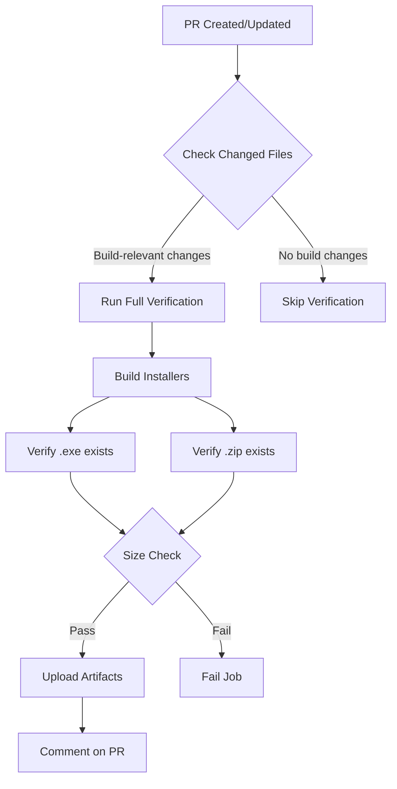
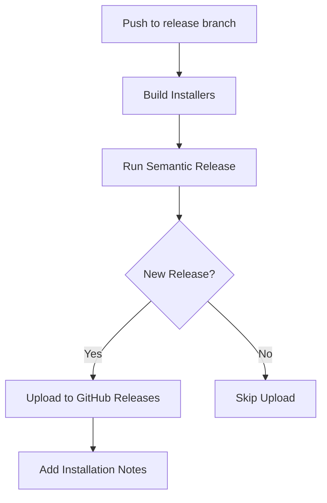

# Smart Build Artifact Verification

## Overview

Build artifact verification has been moved from the release workflow to the qualification workflow with intelligent conditional execution. This ensures artifacts are validated early in the development process, only when relevant files are changed.

## What Changed

### Before

- Build artifact verification ran in the `release.yml` workflow
- Verification happened only during release (too late to catch issues)
- No conditional logic - always ran on every release

### After

- Build artifact verification runs in the `qualification.yml` workflow
- Verification happens on pull requests (early detection)
- Smart conditional execution - only runs when relevant files change
- Release workflow simplified to just build and upload

## Smart Conditional Logic

The verification job only runs when files that affect the build are changed:

```yaml
PATTERNS=(
  "electron/**"           # Electron main/preload files
  "electron-builder.yml"  # Build configuration
  "vite.config.ts"       # Vite build config
  "package.json"         # Dependencies
  "pnpm-lock.yaml"       # Lock file changes
  "src/main.tsx"         # Main entry point
  "index.html"           # HTML template
  "scripts/**"           # Build scripts
)
```

### When Verification Runs

✅ **Runs when:**

- Electron main process code changes
- Build configuration changes
- Dependencies are updated
- Build scripts are modified

⏭️ **Skips when:**

- Only documentation changes
- Test file changes (not affecting build)
- Style/CSS changes
- Component changes that don't affect build output

## Benefits

1. **Early Detection**: Catch build issues in PRs before merging
2. **Faster Feedback**: Developers know immediately if their changes break the build
3. **Cost Efficient**: Only runs when necessary (saves CI minutes)
4. **Better DX**: PR comments provide immediate feedback
5. **Safer Releases**: Release workflow is simpler and more reliable

## Workflow Structure

### Qualification Workflow (PR Checks)



### Release Workflow (Simplified)



## Example PR Comment

When verification passes, the job automatically comments on the PR:

```markdown
✅ **Build Artifact Verification Passed**

Windows installers were successfully built and verified:

- ✓ .exe installer exists
- ✓ .zip archive exists
- ✓ File sizes are valid (>100MB)

Artifacts are available for download in the workflow run.
```

## Verification Steps

1. **File Change Detection**: Checks if PR includes build-relevant changes
2. **Build Execution**: Builds application and Windows installers
3. **Artifact Existence**: Verifies .exe and .zip files exist
4. **Size Validation**: Ensures files are >100MB (prevents incomplete builds)
5. **Artifact Upload**: Makes installers available for testing
6. **PR Feedback**: Comments on PR with results

## Configuration

To modify which file changes trigger verification, edit `.github/workflows/qualification.yml`:

```yaml
PATTERNS=(
  "electron/**"
  "electron-builder.yml"
  # Add more patterns here
)
```

## Testing Locally

To test if your changes would trigger verification:

```bash
# Check changed files in your branch
git diff --name-only origin/main...HEAD

# Match against patterns
git diff --name-only origin/main...HEAD | grep -E "^electron/"
```

## Troubleshooting

### Verification Not Running

- Check if your changes match any of the defined patterns
- Verify the PR is against the `main` branch
- Check workflow logs for the "Check for relevant file changes" step

### Verification Failing

- Check if both .exe and .zip files are being generated
- Verify file sizes are >100MB
- Review build logs for errors
- Check electron-builder configuration

### False Positives/Negatives

If verification runs when it shouldn't (or vice versa):

1. Review the pattern matching logic
2. Add/remove patterns in the `PATTERNS` array
3. Test with `git diff --name-only` locally

## Future Improvements

- [ ] Add verification for macOS/Linux builds
- [ ] Implement artifact size benchmarking (detect bloat)
- [ ] Add smoke tests for generated installers
- [ ] Compare artifact sizes across PRs
- [ ] Auto-update release notes with build info

## Related Documentation

- [PR Qualification Process](./pr-qualification.md)
- [Release Workflow](./release-workflow.md)
- [Build Configuration](../guide/build-configuration.md)

---

**Last Updated**: 2025-10-18  
**Status**: Active ✅
